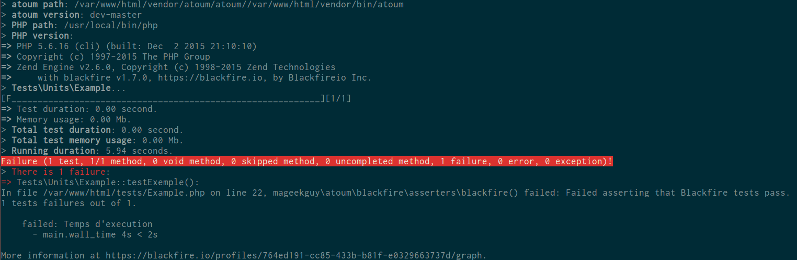

# atoum/blackfire-extension [](https://travis-ci.org/agallou/blackfire-extension)

blackfire-extension allows you to use blackfire assertions inside [atoum](https://github.com/atoum/atoum).

The Blackfire PHP-SDK has a built-in [PHPUnit integration](https://blackfire.io/docs/integrations/phpunit). This extension does the same, but for atoum.

## Example

Let's take this example.

```php
namespace Tests\Units;

use Example as TestedClass;

use atoum;

class Example extends atoum
{
    private $blackfireClient;

    public function testExemple()
    {
        $this
            ->blackfire($this->getBlackfireClient())
                ->assert('main.wall_time < 2s', "Temps d'execution")
                ->profile(function() {
                    sleep(4); //just to make the test fail

                    //some code to profile
                    /.....

                    //you also can run atoum assertions inside this callable
                    //but beware, atoum's logic will also be profiled.
                    $this->boolean(true)->isTrue();
                })
        ;
    }

    private function getBlackfireClient()
    {
        if (null === $this->blackfireClient) {
            $config = new \Blackfire\ClientConfiguration($_ENV['BLACKFIRE_CLIENT_ID'], $_ENV['BLACKFIRE_CLIENT_TOKEN']);
            $this->blackfireClient = new \Blackfire\Client($config);
        }

        return $this->blackfireClient;
    }
}

```

When running this test, the callback will be automatically instrumented and execute on Blackfire the assertions defined by the Configuration. If they fail, an atoum error will be displayed.The above example will have this output : 



## Install it

Install extension using [composer](https://getcomposer.org):

```
composer require --dev atoum/blackfire-extension
```

Enable the extension using atoum configuration file:

```php
<?php

// .atoum.php

require_once __DIR__ . DIRECTORY_SEPARATOR . 'vendor' . DIRECTORY_SEPARATOR . 'autoload.php';

$runner->addExtension(new \mageekguy\atoum\blackfire\extension());
```

## Test filtering

If you need to run the tests without the blackfire extension, you can use [atoum's tags](http://docs.atoum.org/en/latest/launch_test.html#tags) and the [ruler extension](https://github.com/atoum/ruler-extension).


